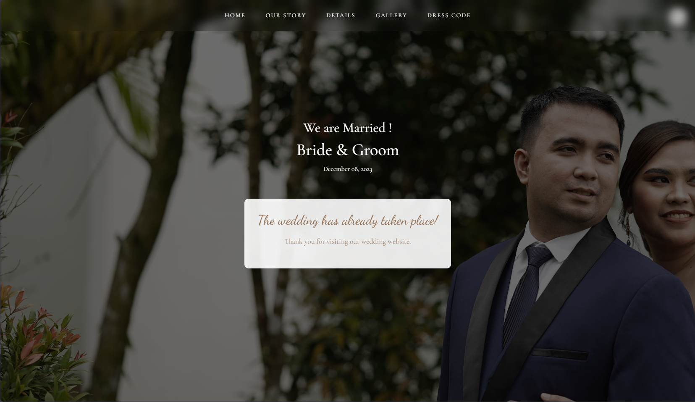

# Wedding Invitation - Hữu Kiên & Đào Huệ



A beautiful, responsive wedding invitation website for **Hữu Kiên & Đào Huệ**. This elegant digital invitation features a countdown timer, love story timeline, and Google Maps integration for the wedding events.

## Features

- 💌 Digital Wedding Invitation
- 📸 Photo Gallery
- 📅 Wedding Timeline
- 📍 Event Details
- 🎯 Responsive Design

## Technologies Used

- HTML5
- CSS3
- JavaScript
- Bootstrap 5
- AOS (Animate On Scroll)
- Google Fonts

## Quick Start

1. View the live demo at [GitHub Pages URL]
2. Or clone and run locally:
```bash
git clone [repo-url]
cd wedding-invitation
# Open index.html in your web browser
```

## Deployment to GitHub Pages

To host this website for free on GitHub Pages:

1.  **Push to GitHub**: Ensure your code is pushed to a repository on GitHub.
2.  **Settings**: Go to your repository on GitHub and click on **Settings**.
3.  **Pages**: In the left sidebar, click on **Pages**.
4.  **Source**: Under "Build and deployment", select **Deploy from a branch**.
5.  **Branch**: Select your main branch (usually `main` or `master`) and the `/ (root)` folder. Click **Save**.
6.  **Wait**: GitHub will build your site. After a minute or two, refresh the page to see your live URL (e.g., `https://username.github.io/repo-name/`).

## Project Structure

```
wedding-invitation/
├── assets/                # Static assets
├── resources/             # Images and media
├── css/                   # Stylesheets
├── js/                    # JavaScript files
└── index.html             # Main entry point
```

## Acknowledgments

- Bootstrap team for the amazing framework
- AOS library for smooth animations
